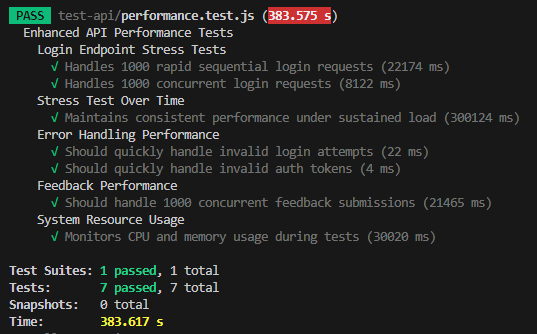

# Document de Démarche pour les Tests de Performance de l’API "Ma Super API"

### Autheur : 
Loïc Esclapez
 
## Objectifs des Tests de Performance

Les objectifs de cette campagne de test de performance sont les suivants :

1. **Simuler un trafic d'utilisateurs** pour trois classes d'API :
   - `contact.js`
   - `feedback.js`
   - `login.js`

2. **Mesurer les temps de réponse moyens** de chaque classe d'API sous différentes charges.
3. **Vérifier la stabilité** des performances lorsque l'API est soumise à une charge élevée.
4. **Identifier les limites de performance** et détecter d’éventuelles dégradations.

## Scénario de Test de Performance

Le test sera exécuté en suivant les étapes suivantes :

1. **Exécution du test de charge** :
   - Simuler **1000 utilisateurs simultanés** pendant **10 minutes** pour chaque classe d'API.
   - Les outils de simulation de charge utilisés incluent **Apache Benchmark (ab)** ou **k6**.
   - Enregistrer les temps de réponse pour chaque requête.

2. **Analyse des résultats** :
   - Évaluer les temps de réponse moyens.
   - Identifier les pics de latence ou éventuelles erreurs.
   - Déterminer la capacité maximale de traitement de l'API.

## Analyse des Résultats

- Average login response time: 22.13ms
- Average concurrent login response time: 190.497ms
- Average sustained load response time: 55.8289817232376ms
- Invalid login response time: 21ms           
- Invalid auth response time: 3ms                                                                                                                                                                             
- Average feedback submission time: 52.389ms 
- Total feedback submissions processed: 1000                                                                                                                                                                                                                                                                                                                                      
- Success rate: 1000 / 1000                                                                                                                                                                               
- Average CPU usage: 0.00%
- Peak memory usage: 56.81 MB      

## Bilan avec PM2 Keymetrics

Keymetrics permet une analyse approfondie des performances :

- CPU : Utilisation très faible (0%)
- Mémoire : 56 MiB utilisés (95% du heap alloué)
- Event Loop Lag : 8,3 ms (P95 : 15,1 ms)
- Heap Usage : 20,8 MiB sur 21,9 MiB alloués

## Conclusion

Ces tests de performance permettent de vérifier quel'api est capable de gérer une charge élevée tout en maintenant des performances acceptables.

